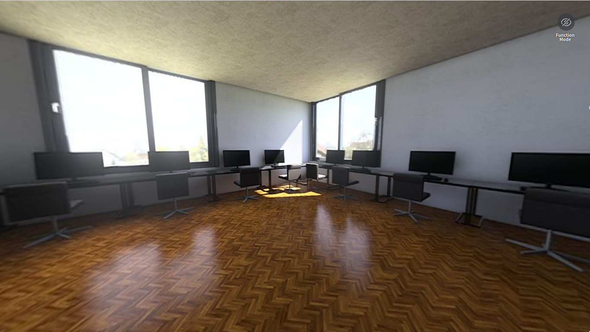
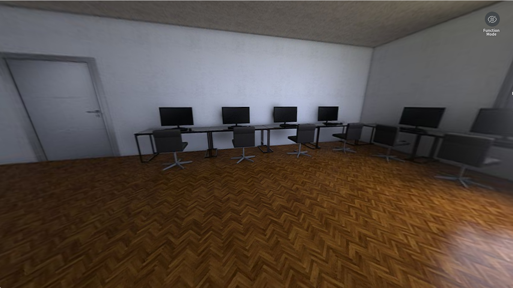
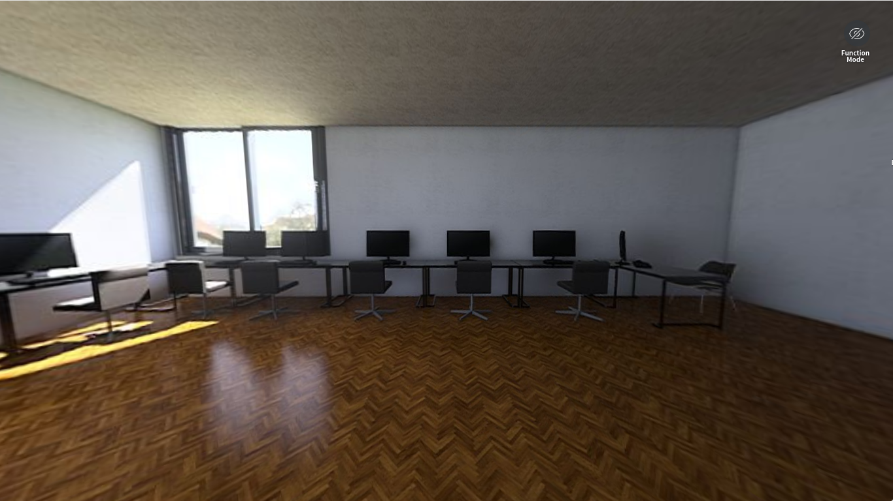
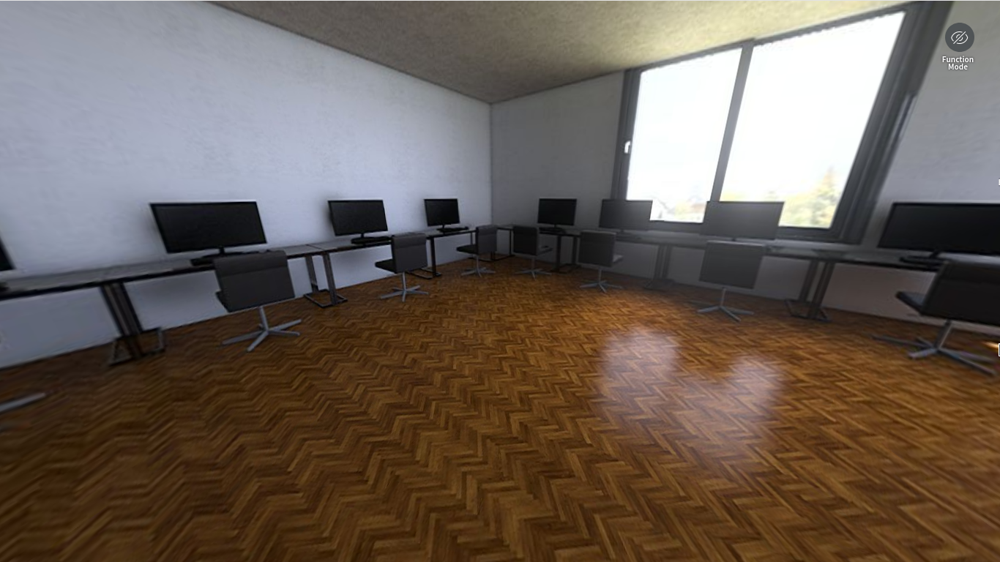

<!DOCTYPE html>
<html>
<head>
	<title>Home</title>
	<meta charset="utf-8">
	<meta name="viewport" content="width=device-width">
	<link rel="stylesheet" type="text/css" href="style.css">
</head>

<body>
	

		

			

				<h1>Arquitetura de computadores</h1>
			

		<nav id="menu-top">
			

				<ul>
					<li><a href="index.html">Home</a></li>
					<li><a href="detalhes.html">Detalhes</a></li>
					<!--<li><a href="index.html">Imagens</a></li>-->
					<li><a href="https://hspano.homestyler.com/?m=p&id=5NaDiwhnaE9Jg9ZTpgP6vQ"
						target="blank">Sala 3D</a></li>
				</ul>				
			

		</nav>
		
		

		

			<h2 align="center">Acerca do trabalho</h2>
			
No âmbito da disciplina de Arquitetura de computadores foi proposto uma atividade na qual
			deveriamos verificar o estado dos cabos de rede, RJ45, presentes em algumas salas do bloco E.
			Sendo assim a turma foi dividida em diversos grupos, onde cada um ficaria responsável por 
			verificar uma das salas.

			

					
					
					
					
			

			

		

		

		<nav id="menu-aside">
			

				<ul>
					<li><a href="index.html">Home</a></li>
					<li><a href="detalhes.html">Detalhes</a></li>
					<!--<li><a href="index.html">Imagens</a></li>-->
					<li><a href="https://hspano.homestyler.com/?m=p&id=5NaDiwhnaE9Jg9ZTpgP6vQ"
						target="blank">Sala 3D</a></li>
				</ul>				
			

		</nav>
		

		

			
Trabalho realizado pelo aluno: Kalleby Santos 06/02/2020

		

	

</body>

</html>
